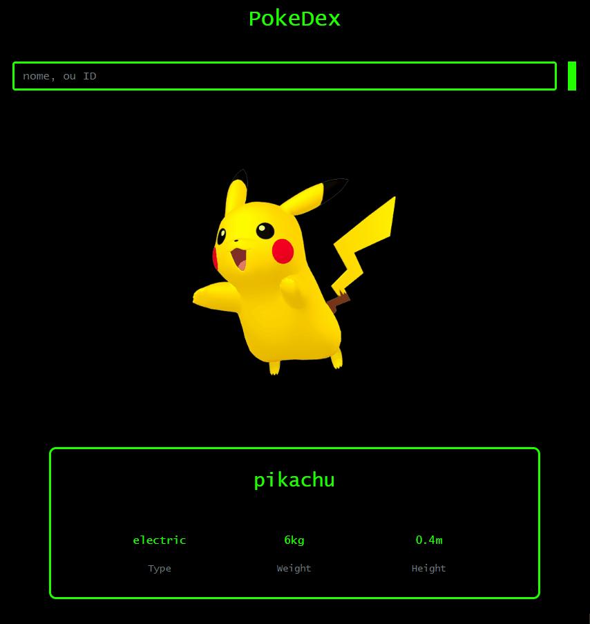

<h1 align=center>Pokedex</h1>
<h2>Sobre o projeto</h2>

Desenvolvi esse projeto para estudos de algumas atividades para faculdade. O foco desse estudo era o consumo de API's, tive a oportunidade de fazer o projeto utilizando uma API open source de <a href='https://pokeapi.co/'>Pokemon</a>, dentro do projeto, utilizando como pesquisa o Nome ou ID do Pokemon, na Pokedex, podemos vizualisar informações como altura(m), peso(kg), e o tipo(type) do pokemon pesquisado.

<h2>Link do projeto</h2>
<a>https://eduardoagusto.github.io/pokemonAPI/</a>

<h2>Imagens do Projeto</h2>

<h2>Design</h2>

Em meus projetos gosto de utilizar um design simples e minimalista, mas sem deixar a desejar. Tal design, foi baseado e referenciado em antigos monitores de fórsforo, que quando combinado com corrente eletrica, brilhava verde. Também, cresci assitindo MATRIX...

<h2>Tecnologias utilizadas</h2>

- JavaScript

- HTML5

- CSS3

